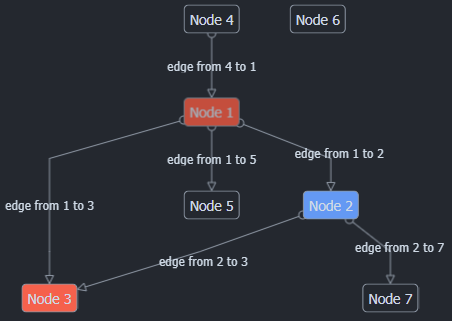

# Rescript-diagram

Easy to use automatic diagram layout component in react.



## Goals

I'm just playing with react-reconciler (as a learning exercise) and an automatic diagram layout algo 
(currently using [dagre](https://github.com/dagrejs/dagre), it might change later since it is deprecated).

- minimal dependencies
- nodes are plain html dom nodes (limit svg to lines)
- using react-reconciler, try to produce very readable DOM nodes
- no styling
- full rescript (_except impossible constructs, like uppercase variables_)

## Minimal code

```rescript
@react.component
let make = () =>
  <Diagram width="300px" height="300px">
    <Diagram.Node key="n1" nodeId="n1"> {"Node 1"->React.string} </Diagram.Node>
    <Diagram.Node key="n2" nodeId="n2"> {"Node 2"->React.string} </Diagram.Node>
    <Diagram.Edge key="n1-n2" source="n1" target="n2" label="edge" />
  </Diagram>
```

Note: you need to provide your own css styling.

## How to use

clone this project, then:

```
npm install
npm run build
npm run dev 
```

Simple application demo can be found in the `example` folder.

## Dynamic layout

A more complex code sample that uses dynamic items:

```rescript

let sample = "1|2|3||1-2|1-3"

let parse = instructions => {
  instructions
  ->Js.String2.split("|")
  ->Belt.Array.keep(line => line->Js.String2.length > 0)
  ->Belt.Array.reduce(([], []), ((nodes, edges) as acc, line) => {
    switch line->Js.String2.split("-") {
    | [node] => (nodes->Belt.Array.concat([node]), edges)
    | [source, target] => (nodes, edges->Belt.Array.concat([(source, target)]))
    | _ => acc
    }
  })
}

let renderArray = (a, fn) => a->Belt.Array.map(fn)->React.array

module App = {
  @react.component
  let make = () => {
    let (nodes, edges) = parse(sample)

    <Diagram className="diagram" width="300px" height="300px">
      {nodes->renderArray(nodeId =>
        <Diagram.Node key={nodeId} nodeId={nodeId}>
          {("Node " ++ nodeId)->React.string}
        </Diagram.Node>
      )}
      {edges->renderArray(((source, target)) =>
        <Diagram.Edge key={source ++ "-" ++ target} source target label="edge" />
      )}
    </Diagram>
  }
}
```

## Links

- https://github.com/facebook/react/tree/main/packages/react-reconciler
- https://github.com/chentsulin/awesome-react-renderer
